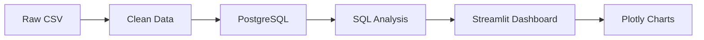
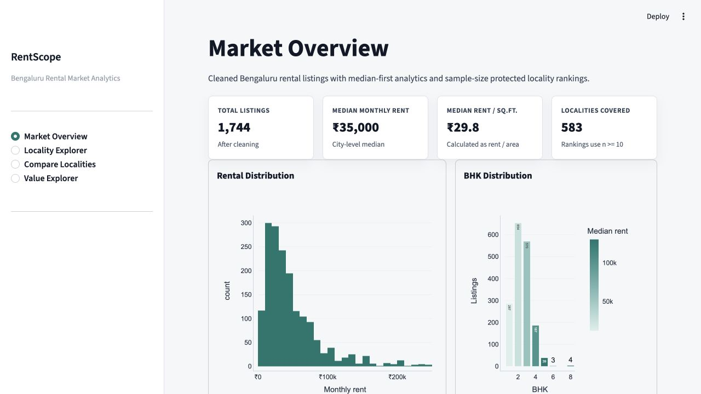
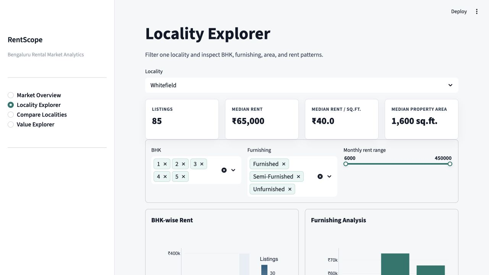
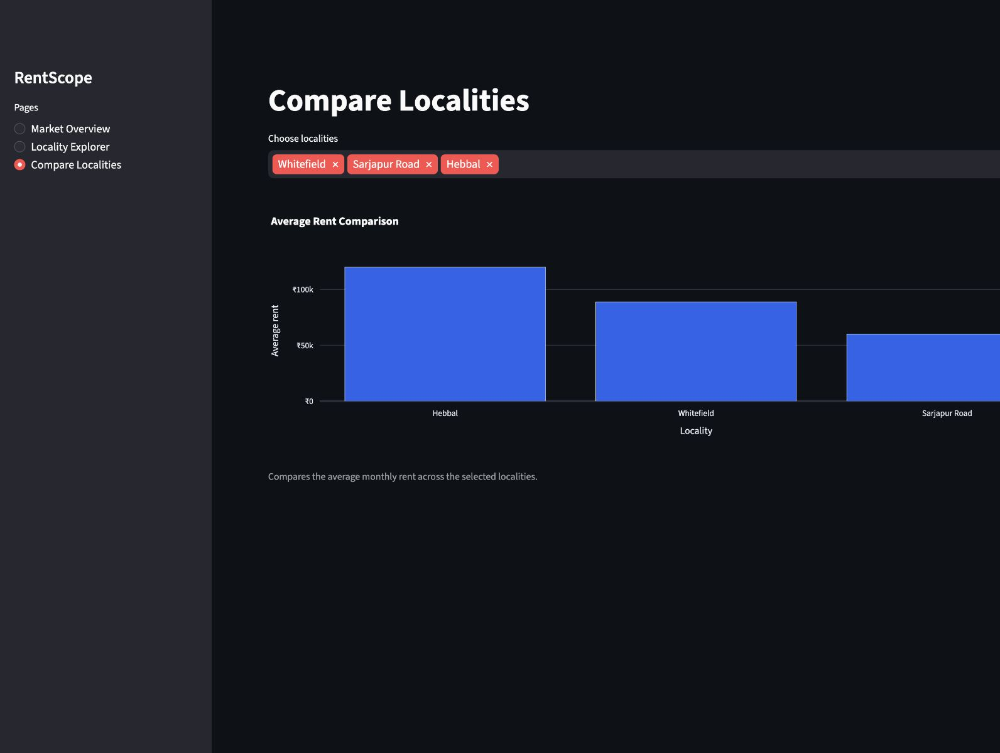

# RentScope

RentScope is a Bengaluru rental market analytics project. It takes raw rental listings, cleans them with Pandas, stores the cleaned data in PostgreSQL, runs SQL analysis, and shows the results in a Streamlit dashboard with Plotly charts.

The project is focused on descriptive analytics only.

---

## Project Overview

RentScope answers simple rental market questions:

- What is the typical rent in Bengaluru?
- How does rent change by BHK?
- Which localities are more expensive?
- How does furnishing type affect rent?

---

## Key Features

| Feature | What It Does |
|---|---|
| Data cleaning | Cleans raw rental listings using Pandas |
| Bengaluru filtering | Keeps only Bengaluru rental records |
| Outlier handling | Removes unusual rent-per-square-foot values using IQR |
| PostgreSQL storage | Stores cleaned listings in a database table |
| SQL analysis | Uses SQL queries for dashboard metrics |
| Locality analysis | Compares rent across localities |
| BHK and furnishing analysis | Shows rent patterns by BHK and furnishing type |
| Visualization mix | Uses a histogram, bar charts, and a line chart |

---

## Technology Stack

| Category | Technology |
|---|---|
| Language | Python |
| Data processing | Pandas |
| Database | PostgreSQL |
| Query language | SQL |
| Dashboard | Streamlit |
| Visualization | Plotly |

---

## System Architecture



---

## Project Structure

```text
RentScope/
├── data/
│   ├── cities_magicbricks_rental_prices.csv
│   └── bengaluru_rentals_clean.csv
├── screenshots/
├── clean_data.py
├── analysis.py
├── database.py
├── app.py
├── requirements.txt
└── README.md
```

| File | Purpose |
|---|---|
| `clean_data.py` | Cleans the raw CSV and creates the cleaned Bengaluru dataset |
| `analysis.py` | Contains reusable Pandas analysis functions |
| `database.py` | Connects to PostgreSQL, creates the table, loads data, and runs SQL queries |
| `app.py` | Builds the Streamlit dashboard |
| `requirements.txt` | Lists the Python packages needed to run the project |
| `data/` | Stores the raw and cleaned CSV files |
| `screenshots/` | Stores dashboard screenshots used in this README |

---

## Dataset Description

The raw dataset is stored here:

```text
data/cities_magicbricks_rental_prices.csv
```

It contains rental listings from different Indian cities. RentScope filters this dataset and keeps only Bangalore/Bengaluru records.

Important columns:

| Column | Meaning |
|---|---|
| `locality` | Area or locality name |
| `city` | City name |
| `area` | Property area in square feet |
| `beds` | Number of bedrooms or BHK |
| `bathrooms` | Number of bathrooms |
| `balconies` | Number of balconies |
| `furnishing` | Furnishing status |
| `rent` | Monthly rent |
| `rent_per_sqft` | Rent divided by area, created during cleaning |

Cleaned output:

```text
data/bengaluru_rentals_clean.csv
```

---
## Dashboard Pages

The dashboard has three pages.

### 1. Market Overview

Shows the overall Bengaluru rental market.

Includes:

- total listings
- median rent
- average rent
- total localities
- rent distribution
- average rent by BHK

### 2. Locality Explorer

Lets the user select one locality and filter listings.

Filters:

- locality
- BHK
- furnishing type

Charts:

- median rent by furnishing
- BHK versus median rent line chart

### 3. Compare Localities

Lets the user compare selected localities.

Charts:

- average rent comparison

---

## Dashboard Screenshots

### Market Overview



### Locality Explorer



### Compare Localities



---

## Installation

Create and activate a virtual environment:

```bash
python3 -m venv .venv
source .venv/bin/activate
```

Install dependencies:

```bash
pip install -r requirements.txt
```

---

## Environment Variables

Create a `.env` file in the project folder:

```text
DB_HOST=localhost
DB_PORT=5432
DB_NAME=rentscope
DB_USER=your_postgres_user
DB_PASSWORD=your_postgres_password
```

---

## Running the Project

Clean the data:

```bash
python clean_data.py
```

Start Streamlit:

```bash
streamlit run app.py
```

Open:

```text
http://localhost:8501
```

---
