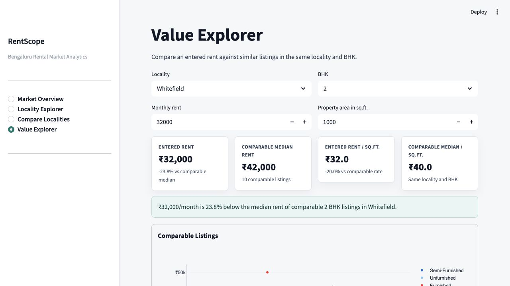
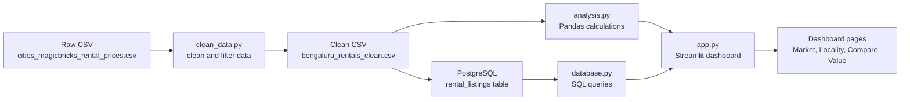

# RentScope

RentScope is a data analytics project on Bengaluru rental listings.

It cleans the rental dataset, stores the cleaned data, and shows the results in a Streamlit dashboard.

The project uses Python, Pandas, SQL, PostgreSQL, Streamlit, and Plotly.

It does not use AI or machine learning.

## Screenshots

These screenshots show the current dashboard screens.

### Market Overview


### Locality Explorer


### Compare Localities


### Value Explorer



## System Architecture



## Project Flow

1. The raw dataset is kept in `data/cities_magicbricks_rental_prices.csv`.
2. `clean_data.py` reads the raw file.
3. The script filters only Bangalore/Bengaluru records.
4. It cleans locality names, furnishing values, rent, area, BHK, bathrooms, and balconies.
5. It calculates `rent_per_sqft` using:

```text
rent_per_sqft = rent / area
```

6. It removes invalid rows and suspicious rent per sq.ft. outliers.
7. The cleaned data is saved as `data/bengaluru_rentals_clean.csv`.
8. `database.py` can load this cleaned data into PostgreSQL.
9. SQL queries are used for important dashboard metrics.
10. `analysis.py` also has Pandas functions for calculations and fallback use.
11. `app.py` shows the dashboard using Streamlit and Plotly.

If PostgreSQL is not connected, the dashboard still runs using the cleaned CSV.

## Files

```text
data/cities_magicbricks_rental_prices.csv
data/bengaluru_rentals_clean.csv
screenshots/
clean_data.py
analysis.py
database.py
app.py
requirements.txt
.env.example
README.md
```

## Dataset

The raw dataset is:

```text
data/cities_magicbricks_rental_prices.csv
```

This file is not edited.

The cleaned file is:

```text
data/bengaluru_rentals_clean.csv
```

Current cleaning result:

```text
Raw rows: 7,691
Bengaluru rows: 1,790
Cleaned Bengaluru rows: 1,744
```

## Cleaning Steps

`clean_data.py` does this:

- checks the dataset shape, columns, missing values, cities, rent, and area
- keeps only Bengaluru listings
- removes duplicate rows
- fixes text formatting in city, locality, and furnishing columns
- converts numeric columns to numbers
- removes invalid rent and area values
- removes suspicious rent per sq.ft. outliers
- creates the cleaned CSV

## Dashboard Pages

### Market Overview

Shows the main market numbers:

- total listings
- median monthly rent
- median rent per sq.ft.
- localities covered
- rent distribution
- BHK distribution
- top localities

### Locality Explorer

Lets the user select one locality and check:

- listings
- median rent
- median rent per sq.ft.
- BHK-wise rent
- furnishing-wise rent
- area vs rent

### Compare Localities

Lets the user compare 2 or 3 localities using:

- median rent
- median rent per sq.ft.
- listing count
- median area
- BHK-wise comparison
- furnishing-wise comparison

### Value Explorer

Lets the user enter:

- locality
- BHK
- monthly rent
- property area

Then it compares the entered rent with similar listings from the same locality and BHK.

This is only a data comparison. It is not a prediction.

## How to Run

Install the packages:

```bash
python3 -m venv .venv
source .venv/bin/activate
pip install -r requirements.txt
```

Run the cleaning script:

```bash
python clean_data.py
```

Run the dashboard:

```bash
streamlit run app.py
```

Open:

```text
http://localhost:8501
```

## PostgreSQL Setup

Create a database named `rentscope`.

Then create a `.env` file:

```bash
cp .env.example .env
```

Example `.env`:

```text
DB_HOST=localhost
DB_PORT=5432
DB_NAME=rentscope
DB_USER=kriti_10
DB_PASSWORD=
```

When the app starts, it creates a table called `rental_listings` and loads the cleaned data.

If PostgreSQL is not ready, the app uses the cleaned CSV instead.

## Why Median Is Used

Rent data has some very expensive homes.

Because of this, average rent can become too high.

Median rent gives a better picture of a normal listing.

## Notes

- Locality rankings use only localities with enough listings.
- `area_rate` is checked, but `rent_per_sqft` is calculated again from rent and area.
- PostgreSQL is used for SQL-based dashboard metrics.
- No fake data is used.
- No scraping is used.
- No AI or machine learning is used.
