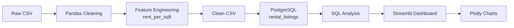

# RentScope

RentScope is a Bengaluru rental market analytics project. It takes raw rental listings, cleans them with Pandas, stores the cleaned data in PostgreSQL, runs SQL analysis, and shows the results in a Streamlit dashboard with Plotly charts.

The project is focused on descriptive analytics only.

---

## Project Overview

RentScope answers simple rental market questions:

- What is the typical rent in Bengaluru?
- How does rent change by BHK?
- Which localities are more expensive?
- How does furnishing type affect rent?
- Which localities have better rent per square foot?

---

## Key Features

| Feature | What It Does |
|---|---|
| Data cleaning | Cleans raw rental listings using Pandas |
| Bengaluru filtering | Keeps only Bengaluru rental records |
| Outlier handling | Removes unusual rent-per-square-foot values using IQR |
| Rent per sq.ft. | Calculates `rent_per_sqft = rent / area` |
| PostgreSQL storage | Stores cleaned listings in a database table |
| SQL analysis | Uses SQL queries for dashboard metrics |
| Locality analysis | Compares rent across localities |
| BHK and furnishing analysis | Shows rent patterns by BHK and furnishing type |
| Visualization mix | Uses a histogram, bar charts, a box plot, a grouped bar chart, and a pie chart |

---

## Technology Stack

| Category | Technology |
|---|---|
| Language | Python |
| Data processing | Pandas |
| Database | PostgreSQL |
| Query language | SQL |
| Dashboard | Streamlit |
| Visualization | Plotly |

---

## System Architecture



---

## Project Structure

```text
RentScope/
├── data/
│   ├── cities_magicbricks_rental_prices.csv
│   └── bengaluru_rentals_clean.csv
├── clean_data.py
├── analysis.py
├── database.py
├── app.py
├── requirements.txt
└── README.md
```

| File | Purpose |
|---|---|
| `clean_data.py` | Cleans the raw CSV and creates the cleaned Bengaluru dataset |
| `analysis.py` | Contains reusable Pandas analysis functions |
| `database.py` | Connects to PostgreSQL, creates the table, loads data, and runs SQL queries |
| `app.py` | Builds the Streamlit dashboard |
| `requirements.txt` | Lists the Python packages needed to run the project |
| `data/` | Stores the raw and cleaned CSV files |

---

## Dataset Description

The raw dataset is stored here:

```text
data/cities_magicbricks_rental_prices.csv
```

It contains rental listings from different Indian cities. RentScope filters this dataset and keeps only Bangalore/Bengaluru records.

Important columns:

| Column | Meaning |
|---|---|
| `locality` | Area or locality name |
| `city` | City name |
| `area` | Property area in square feet |
| `beds` | Number of bedrooms or BHK |
| `bathrooms` | Number of bathrooms |
| `balconies` | Number of balconies |
| `furnishing` | Furnishing status |
| `rent` | Monthly rent |
| `rent_per_sqft` | Rent divided by area, created during cleaning |

Cleaned output:

```text
data/bengaluru_rentals_clean.csv
```

---

## Data Cleaning Process

Data cleaning happens in `clean_data.py`.

| Step | Description |
|---|---|
| City filtering | Keeps only Bangalore/Bengaluru records |
| Duplicate removal | Removes repeated listings |
| Missing values | Drops rows missing important fields |
| Type conversion | Converts rent, area, BHK, bathrooms, and balconies into numeric values |
| Text cleaning | Standardizes locality and furnishing values |
| Feature engineering | Creates `rent_per_sqft` |
| Outlier handling | Uses IQR to remove unusual rent-per-square-foot records |

Main formula:

```text
rent_per_sqft = rent / area
```

---

## Database Layer

PostgreSQL is used to store the cleaned dataset in one table:

```text
rental_listings
```

The database layer handles:

- connecting to PostgreSQL
- creating the `rental_listings` table
- loading the cleaned CSV
- calculating market metrics with SQL
- calculating locality metrics with SQL

Main database functions:

| Function | Purpose |
|---|---|
| `get_connection()` | Opens a PostgreSQL connection |
| `create_table()` | Creates the rental listings table |
| `load_data()` | Loads the cleaned CSV into PostgreSQL |
| `market_metrics()` | Returns overall market metrics |
| `locality_metrics()` | Returns locality-wise metrics |

---

## Analysis Layer

`analysis.py` contains simple Pandas functions used by the dashboard.

| Function | Purpose |
|---|---|
| `load_clean_data()` | Loads the cleaned CSV |
| `market_summary()` | Calculates overall market summary values |
| `bhk_distribution()` | Groups listings by BHK |
| `furnishing_distribution()` | Groups listings by furnishing type |
| `locality_metrics()` | Calculates locality-wise values |

---

## Dashboard Pages

The dashboard has three pages.

### 1. Market Overview

Shows the overall Bengaluru rental market.

Includes:

- total listings
- median rent
- average rent
- median rent per square foot
- total localities
- rent distribution
- BHK distribution

### 2. Locality Explorer

Lets the user select one locality and filter listings.

Filters:

- locality
- BHK
- furnishing type

Charts:

- median rent by furnishing
- rent distribution by BHK box plot

### 3. Compare Localities

Lets the user compare selected localities.

Charts:

- grouped comparison of median rent, rent per square foot, and listing count
- locality share pie chart

---

## Installation

Create and activate a virtual environment:

```bash
python3 -m venv .venv
source .venv/bin/activate
```

Install dependencies:

```bash
pip install -r requirements.txt
```

---

## Environment Variables

Create a `.env` file in the project folder:

```text
DB_HOST=localhost
DB_PORT=5432
DB_NAME=rentscope
DB_USER=your_postgres_user
DB_PASSWORD=your_postgres_password
```

---

## Running the Project

Clean the data:

```bash
python clean_data.py
```

Start Streamlit:

```bash
streamlit run app.py
```

Open:

```text
http://localhost:8501
```

---

## Interview Summary

RentScope is an end-to-end data analytics project. I started with a raw rental CSV, cleaned it using Pandas, created a rent-per-square-foot feature, removed outliers using IQR, loaded the cleaned data into PostgreSQL, used SQL for market and locality metrics, and built an interactive Streamlit dashboard with Plotly charts.

The project shows locality-wise, BHK-wise, and furnishing-wise rental patterns for Bengaluru.
