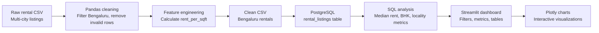

# RentScope

RentScope is an end-to-end rental market analytics platform built for Bengaluru rental listings.

The project cleans raw rental data, creates useful rental metrics, stores the cleaned data in PostgreSQL, runs SQL-based analysis, and presents the results through an interactive Streamlit dashboard with Plotly visualizations.

The main objective is to turn raw rental records into clear insights about locality-wise, BHK-wise, and furnishing-wise rent patterns.

---

## Project Overview

RentScope follows a simple analytics workflow:

```text
Raw rental CSV
    -> Data cleaning with Pandas
    -> Feature engineering
    -> PostgreSQL storage
    -> SQL analysis
    -> Streamlit dashboard
    -> Plotly charts
```

The project focuses on descriptive analytics. It does not use artificial intelligence, machine learning, rent prediction, or recommendation models.

---

## Key Features

| Feature | Description |
|---|---|
| Data cleaning | Cleans raw rental listing data using Pandas |
| Bengaluru filtering | Keeps only Bangalore/Bengaluru rental records |
| Outlier handling | Removes suspicious rent-per-square-foot outliers using IQR |
| Rent per sq.ft. | Calculates `rent_per_sqft = rent / area` |
| SQL analysis | Uses PostgreSQL queries for important dashboard metrics |
| Locality comparison | Compares localities by median rent and rent per sq.ft. |
| BHK analysis | Shows rental patterns across BHK categories |
| Furnishing analysis | Compares rent across furnishing types |
| Interactive dashboard | Provides filters, charts, metrics, and tables in Streamlit |

---

## Technology Stack

| Category | Technology |
|---|---|
| Language | Python |
| Data processing | Pandas |
| Database | PostgreSQL |
| Query language | SQL |
| Dashboard | Streamlit |
| Visualization | Plotly |

---

## System Architecture



---

## Project Structure

```text
RentScope/
├── data/
│   ├── cities_magicbricks_rental_prices.csv
│   └── bengaluru_rentals_clean.csv
├── clean_data.py
├── analysis.py
├── database.py
├── app.py
├── requirements.txt
└── README.md
```

| File | Purpose |
|---|---|
| `clean_data.py` | Cleans the raw dataset and creates the cleaned Bengaluru CSV |
| `analysis.py` | Contains reusable Pandas analysis functions |
| `database.py` | Handles PostgreSQL connection, table creation, loading, and SQL queries |
| `app.py` | Builds the Streamlit dashboard |
| `requirements.txt` | Lists Python dependencies |
| `data/` | Stores raw and cleaned CSV files |

---

## Dataset Description

The raw dataset is stored at:

```text
data/cities_magicbricks_rental_prices.csv
```

The dataset contains rental listings from multiple Indian cities. RentScope filters this data and analyzes only Bangalore/Bengaluru records.

Main columns:

| Column | Meaning |
|---|---|
| `house_type` | Listing title or property type description |
| `locality` | Area or locality name |
| `city` | City name |
| `area` | Property area in square feet |
| `beds` | Number of bedrooms or BHK |
| `bathrooms` | Number of bathrooms |
| `balconies` | Number of balconies |
| `furnishing` | Furnishing status |
| `area_rate` | Rent per area value provided in the dataset |
| `rent` | Monthly rent |

Cleaned output:

```text
data/bengaluru_rentals_clean.csv
```

Current cleaning result:

| Stage | Records |
|---|---:|
| Raw dataset | 7,691 |
| Bengaluru records | 1,790 |
| Cleaned Bengaluru records | 1,744 |

---

## Data Cleaning Pipeline

Data cleaning is implemented in `clean_data.py`.

The script performs the following steps:

| Step | What Happens |
|---|---|
| Dataset inspection | Checks shape, data types, missing values, city values, BHK values, rent, and area |
| City filtering | Keeps only Bangalore/Bengaluru records |
| Duplicate removal | Removes repeated rows |
| Missing-value handling | Drops rows missing critical values |
| Text standardization | Cleans locality, city, and furnishing values |
| Numeric conversion | Converts rent, area, BHK, bathrooms, balconies, and area rate to numeric types |
| Feature engineering | Creates `rent_per_sqft` |
| Outlier handling | Uses IQR on `rent_per_sqft` to remove suspicious rows |
| Output generation | Saves the cleaned CSV |

Main calculated field:

```text
rent_per_sqft = rent / area
```

This metric helps compare rentals more fairly because monthly rent alone can be affected by property size.

---

## Database Architecture

PostgreSQL integration is implemented in `database.py`.

The database table is:

```text
rental_listings
```

The table stores cleaned Bengaluru rental records with fields such as:

| Field | Purpose |
|---|---|
| `locality` | Used for locality-wise filtering and grouping |
| `beds` | Used for BHK-wise filtering and analysis |
| `furnishing` | Used for furnishing-wise comparison |
| `area` | Used for area-based analysis |
| `rent` | Main monthly rent value |
| `rent_per_sqft` | Main normalized rent metric |

The database layer keeps the logic simple:

- connect to PostgreSQL
- create the `rental_listings` table
- load the cleaned CSV
- run SQL aggregation queries
- return data to the dashboard

SQL is used for important metrics such as:

- total listings
- average rent
- median rent
- median rent per sq.ft.
- locality-wise rental metrics

---

## Analysis Layer

Reusable analysis functions are stored in `analysis.py`.

This file keeps common Pandas logic separate from the dashboard.

| Function | Purpose |
|---|---|
| `load_clean_data()` | Loads the cleaned CSV |
| `market_summary()` | Calculates overall market metrics |
| `bhk_distribution()` | Groups listings by BHK |
| `furnishing_distribution()` | Groups listings by furnishing status |
| `locality_metrics()` | Calculates locality-wise metrics |
| `comparable_properties()` | Compares an entered property with similar listings |

This separation makes the project easier to explain and maintain.

---

## Dashboard Pages

The dashboard is implemented in `app.py` using Streamlit and Plotly.

### 1. Market Overview

Shows the overall Bengaluru rental market.

Includes:

- total listings
- median rent
- median rent per sq.ft.
- localities covered
- rent distribution
- BHK distribution
- top localities by median rent
- top localities by rent per sq.ft.
- furnishing analysis

### 2. Locality Explorer

Allows users to select a locality and explore its rental listings.

Filters:

- BHK
- furnishing type
- rent range

Charts:

- median rent by BHK
- median rent by furnishing
- area vs rent scatter plot

### 3. Compare Localities

Allows comparison of 2 or 3 localities.

Shows:

- median rent
- median rent per sq.ft.
- listing count
- BHK-wise comparison

This page helps compare both price level and value by area.

### 4. Value Explorer

Allows the user to enter:

- locality
- BHK
- monthly rent
- property area

The app compares the entered property with similar records from the same locality and BHK.

This is a descriptive comparison only. It is not a rent prediction model.

---

## Installation Instructions

Create and activate a virtual environment:

```bash
python3 -m venv .venv
source .venv/bin/activate
```

Install dependencies:

```bash
pip install -r requirements.txt
```

Clean the dataset:

```bash
python clean_data.py
```

---

## Environment Variables

Create a `.env` file in the project folder with your PostgreSQL details:

```text
DB_HOST=localhost
DB_PORT=5432
DB_NAME=rentscope
DB_USER=your_postgres_user
DB_PASSWORD=your_postgres_password
```

Example database name:

```text
rentscope
```

---

## Running the Application

Start the Streamlit dashboard:

```bash
streamlit run app.py
```

Open the local app:

```text
http://localhost:8501
```
---
